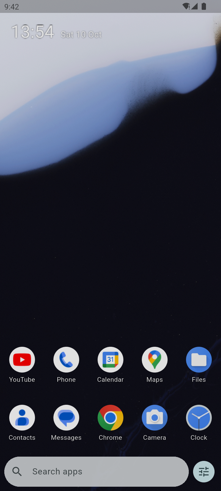
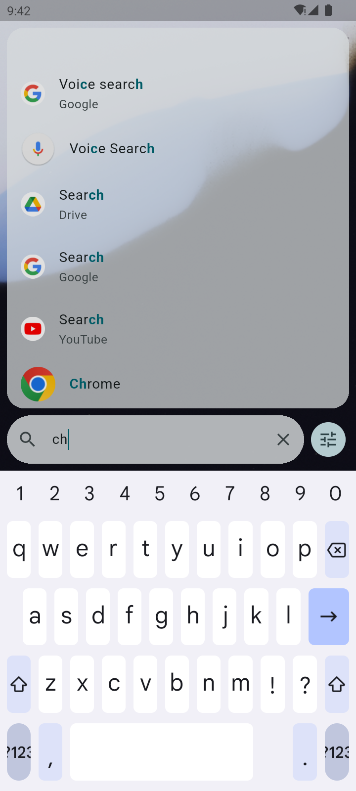
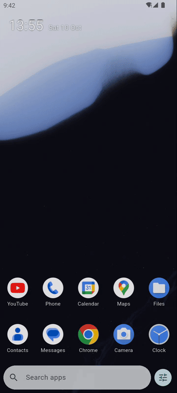
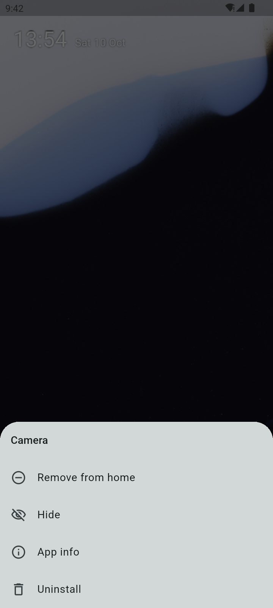
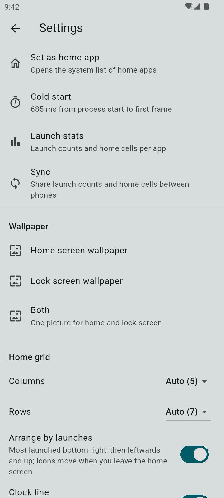
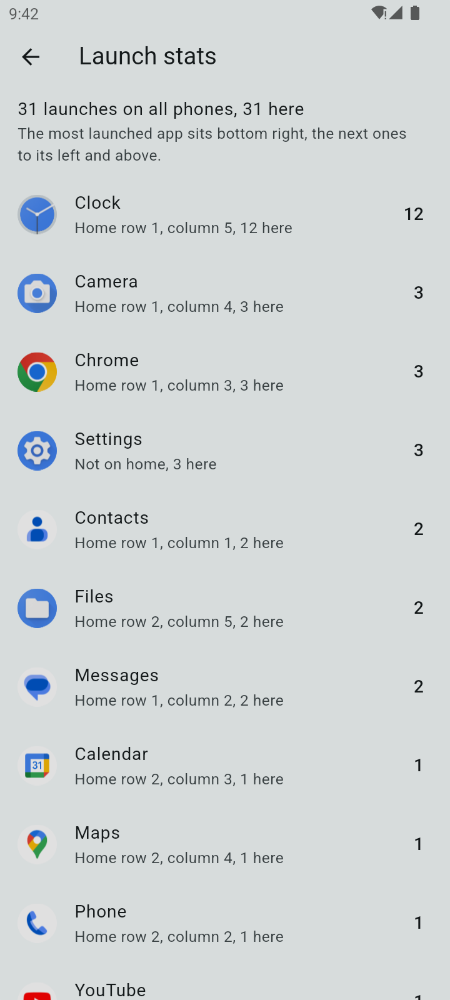

# The TurboLaunch guide

TurboLaunch is a home screen for Android that you mostly type into. This
guide shows every feature, with screenshots and a short recording taken on
the Android emulator by `tool/shots_android.sh`, so the apps in them are the
emulator's own.

1. [Installing](#installing)
2. [The home screen](#the-home-screen)
3. [Searching](#searching)
4. [The home grid](#the-home-grid)
5. [The app menu and hidden apps](#the-app-menu-and-hidden-apps)
6. [Gestures](#gestures)
7. [App pairs](#app-pairs)
8. [Work profile apps](#work-profile-apps)
9. [Settings](#settings)
10. [Launch stats](#launch-stats)
11. [Moving to a new phone](#moving-to-a-new-phone)
12. [Sync between phones](#sync-between-phones)
13. [Privacy and permissions](#privacy-and-permissions)
14. [Building it yourself](#building-it-yourself)

## Installing

TurboLaunch comes from the
[snonux F-Droid repository](https://github.com/snonux/fdroid). Add it once
on the phone by tapping
**[Add to F-Droid](https://fdroid.link/#https://snonux.github.io/fdroid/repo?fingerprint=04B05FB0565543E058372B867B3D3A699D9D668388CE670478EDD4116D736DF7)**,
or by hand in F-Droid under *Settings, Repositories, +*:

* Address: `https://snonux.github.io/fdroid/repo`
* Fingerprint: `04B05FB0565543E058372B867B3D3A699D9D668388CE670478EDD4116D736DF7`

Then install TurboLaunch like any F-Droid app. F-Droid offers updates when
a new version comes out. The APKs are also attached to every
[GitHub release](https://github.com/snonux/turbolaunch/releases); take
`app-arm64-v8a-release.apk` for a current phone.

Press Home once installed, and Android asks which home app to use. Pick
TurboLaunch and "Always". If it does not ask, open TurboLaunch's settings
(the sliders button next to the search box) and tap **Set as home app**, or go to
*Settings, Apps, Default apps, Home app*. Your old launcher stays installed,
so you can always switch back the same way.

## The home screen



From top to bottom:

* **The clock line**: time and date (battery optional in settings; off by
  default because Android already shows it). Long-press it to hide the
  grid, for example while sharing your screen (see
  [Quick hide](#gestures)).
* **Your wallpaper**, with empty space you can double-tap to lock the
  phone.
* **The home grid** of your most-used apps, the most-launched nearest your
  thumb.
* **The search box**, always there at the bottom, with the settings button
  beside it.

Pressing Home while TurboLaunch is in front clears the search and closes
settings, so Home always brings you back to this screen.

## Searching



Tap the search box (or turn on **Open the keyboard on Home** in settings)
and type a few letters of the app. The search works like
[fzf](https://github.com/junegunn/fzf): the letters must come in order but
may have gaps, so "orgm" finds Organic Maps and "sttngs" finds Settings.
Letters at the start of a word, and letters next to each other, count for
more. The best match sits at the bottom of the list, right above the
search box, and the app you mean is usually that one. Matched letters are
highlighted.

**Enter opens the best match.** Tapping any result opens that one.

App shortcuts are results too: "New tab" for the browser,
"New note", "Navigate home" and whatever else your apps offer on a
long-press elsewhere.



The × in the search box, Back or Home clear the search.

## The home grid

Every launch counts. The home grid is arranged by launches: the app you
launch most sits in the bottom right corner, the next one to its left, and
so on along the bottom row, then the row above. The favourites sit right
above the search box, under your thumb.

As counts change, icons move to their new place, but never while you look
at the home screen: the grid is arranged when you leave it (by opening an
app, for example) or press Home. **Remove from home** keeps an app off the
grid; **Add to home** brings it back, and an app you never launched then
stays after the others.

**Arrange by launches** under **Home grid** in settings is on by default.
Turn it off and an app that has a cell keeps it: icons never shuffle
around, the grid fills from the bottom row up, left to right, and a cell
only frees up when you uninstall or hide the app, choose **Remove from
home**, or make the grid smaller than the app's cell. The next
most-launched app without a cell then takes it.

The grid sizes itself from the screen: one column per 80 dp and one row
per 96 dp, fewer with bigger labels. Set the rows and columns yourself under
**Home grid** in settings if you want more or fewer.

## The app menu and hidden apps



Long-press an app, on the grid or in the search results:

* **Remove from home** takes it off the grid and keeps it off. It stays in
  search. **Add to home** brings it back.
* **Hide** takes it out of search and off the grid. Hidden apps are listed
  in settings under **Hidden apps**, with **Unhide**. Typing a hidden
  app's full name still finds it, and its menu then offers **Unhide**.
* **App info** opens Android's page for the app.
* **Uninstall** asks Android to remove it.

An app pair's menu has **Delete pair** in place of App info and Uninstall.

## Gestures

* **Swipe up** on the home screen to open the search with the keyboard up.
* **Swipe down** to pull down the notification shade.
* **Double-tap empty space** to lock the phone. Taps on apps stay instant;
  only empty cells and wallpaper listen for double-taps.
* **Long-press the clock line** to hide the grid (quick hide), and again to
  show it.

Under **Gestures** in settings, tap a swipe (up, down, left or right) to
choose what it does: open the search, notifications, quick settings, an
app, an app pair or an app shortcut, lock the screen, recent apps, the
power menu, a screenshot, split screen, the flashlight, quick hide,
TurboLaunch's settings or the launch stats, or nothing.

**Record a gesture** adds your own: draw a chain of straight strokes on the
pad, such as up then right, then pick what it does. Start gestures on empty
home space and a little away from the screen edges, where Android's own
back and home gestures win. A recorded gesture can be deleted with its bin
icon.

Locking, recent apps, the power menu, screenshots and split screen need the
accessibility service, see [Privacy and permissions](#privacy-and-permissions).

### Screenshots of any app

TurboLaunch adds a **Screenshot** tile to quick settings. Add it once by
editing the tiles (the pencil in the pulled-down quick settings), then, in
any app, pull down quick settings and tap **Screenshot**: the shade closes
and the screen behind it is saved like a screenshot taken with the buttons.
The tile needs the accessibility service too; with it off, tapping the tile
opens the accessibility settings.

## App pairs

An app pair opens two apps in split screen, one above the other, with one
tap. Make one in settings under **App pairs**: pick a **Top app** and a
**Bottom app**, give it a name if you like, and **Save pair**. **Try it**
opens them without saving.

A saved pair is an app of its own: it shows up in search, counts its
launches and earns a home cell like any app. If you uninstall one of its
two apps, the pair disappears until it is back.

Opening a pair needs the accessibility service, which switches into split
screen. Without it only the top app opens.

## Work profile apps

Apps in a work profile (for example one made by Shelter, Insular or your
employer) are listed and searchable with a small badge. While work apps are
paused they are drawn grey, and opening one asks Android to resume them.

On a phone with several users, each user installs and sets up TurboLaunch
on their own.

## Settings



The sliders button next to the search box opens settings:

* **Set as home app** opens Android's list of home apps.
* **Cold start** shows how long TurboLaunch took from start to its first
  frame.
* **Launch stats**, see below.
* **Sync**, see [Sync between phones](#sync-between-phones).
* **Wallpaper**: pick a picture for the home screen, the lock screen or
  both. The home screen shows Android's wallpaper through it.
* **Home grid**: columns and rows (Auto, or a number), whether to show the
  clock line, and whether to show the battery on it (off by default).
* **Search**: open the keyboard on Home, and icons in the search results.
* **Gestures**: the accessibility service, double-tap to lock, what each
  swipe does, and your own recorded gestures.
* **Font sizes** for grid labels, search results and the clock line.
* **Hidden apps**, **App pairs** and **Your data** (export and import).

Light and dark follow the system setting.

## Launch stats



How often you launched each app, most-launched first, and which home cell
it holds. With [sync](#sync-between-phones) on, the counts are those of all
your phones, with this phone's share beside each.

## Moving to a new phone

**Export settings** under **Your data** saves everything in one JSON file:
settings, app pairs, hidden apps, launch counts and the home grid. Copy it
to the new phone and use **Import settings** there. Android's own file
dialogs do the saving and opening, so TurboLaunch needs no storage
permission.

Import replaces what is on the phone; it asks first. The file also holds
the sync settings, S3 keys included, in plain text, so keep it somewhere
private. With sync on, the launch counts in the file are left out: the
bucket has them already, under the phone that made them.

## Sync between phones

**Settings, Sync** shares launch counts and home cells between your phones
through an S3 bucket of your own (Garage, MinIO, AWS S3 and others; it
uses the same client and settings as Quicklog). Fill in the endpoint,
region, bucket, access key ID and secret key, give the phone a name, switch
**Sync between phones** on and tap **Sync now**. Below it, **Other
phones** lists the phones the last sync found, with their launches and
when they last synced.

* Every phone writes one file of its own, `turbolaunch/devices/<id>.json`,
  and reads the others. Nothing a phone writes is ever overwritten by
  another.
* Launch counts add up across phones. The stats screen shows the total and
  how many launches were on this phone.
* Arranged by launches (the default), every phone ranks the apps by the
  launches of all phones together, so the grids match. An app this phone
  does not have keeps its place as a ghost (see below). The rest of this
  list is for **Arrange by launches** turned off.
* The first time a phone meets your other phones, it takes over the grid of
  the phone with the most launches (if that is another phone). Its own apps
  that are not in that grid get the free cells, most-launched first.
* After that, a placed icon never moves. An app that gets a cell later goes
  to the cell it has on your other phones, if that cell is free here.
* A cell kept for an app this phone does not have shows a faded ghost of
  that app with its name, so the grid looks the same on every phone.
  Tapping the ghost only says the app is on your other phones; install the
  app and it takes the cell. When every other cell is full, an app of this
  phone may use a ghost's cell until you install the ghost's app; it is
  drawn a little grey there.
* Rows count from the bottom, so phones with more or fewer rows still agree
  on the cells nearest the search box. Small differences between phones are
  normal.
* TurboLaunch syncs a few seconds after it starts, half a minute after a
  launch, and on Home when it has not synced for 15 minutes. These
  automatic syncs fail silently, for example when the server is down;
  **Sync now** shows what went wrong.
* Files are plain JSON, without encryption of their own: use a bucket only
  you can read.

## Privacy and permissions

TurboLaunch has no tracking, no ads and no Google Play Services.
Everything stays on the phone unless you turn on sync, which talks only to
the S3 server you enter.

It asks for:

* **Internet**, for the optional sync. Nothing goes out while sync is off.

* **Set wallpaper**, for the wallpaper setting.
* **Request uninstall**, so the menu can ask Android to uninstall an app
  (Android still asks you).
* **Expand status bar**, for notifications and quick settings when the
  accessibility service is off. It uses a hidden Android call that home apps have long relied on; if
  a future Android removes it, the swipe simply does nothing.

**The accessibility service "TurboLaunch actions" is optional and off
until you turn it on** under *Settings, Accessibility* (the **Accessibility
service** line in TurboLaunch's settings takes you there). It only performs
system actions: lock the screen on a double-tap, pull down the
notifications or quick settings, switch into split screen for an app pair,
and open recent apps, the power menu or take a screenshot when a gesture you
set up or the Screenshot tile asks for it. It reads no
screen content and sees nothing you type.

## Building it yourself

You need Flutter (the version in `.flutter-version`), JDK 17 or 21 and the
Android SDK:

```sh
git clone https://github.com/snonux/turbolaunch.git
cd turbolaunch
flutter build apk --release --split-per-abi
adb install build/app/outputs/flutter-apk/app-arm64-v8a-release.apk
```

Without a release key the build is signed with the debug key, so it does
not update the F-Droid version (uninstall that first). Building, testing and
releasing are described in [AGENTS.md](../../AGENTS.md).
